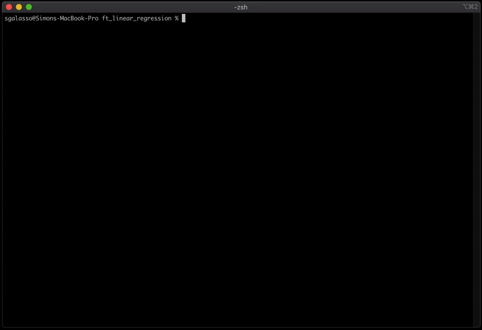

# ft_linear_regression
A linear regression implementation, written in Rust<br/>
This is a 42 school project <strong>[Final grade: 125%]</strong>

---
## Demo


---
## Setup
If you do not have Rust
```
> curl --proto '=https' --tlsv1.2 -sSf https://sh.rustup.rs | sh
> export PATH=$PATH:$HOME/.cargo/bin
```
Then you can build the project
```
> cargo build --release
```

---
## Learn usage
```
> ./target/release/learn <file> [OPTIONS]
```
### Flags
```
-h, --help       Prints help information
-V, --version    Prints version information
```
### Options
```
-a, --algo <algo>    Algo selection, choose from 'ols' or 'gradient'
```

---
## Predict usage
```
> ./target/release/predict output/save.txt
```

---
## Contributors
<table>
  <tr>
    <td align="center"><a href="https://github.com/sgalasso42"><br /><sub><b>Simon Galasso</b></sub></a><br />
  </tr>
</table>
